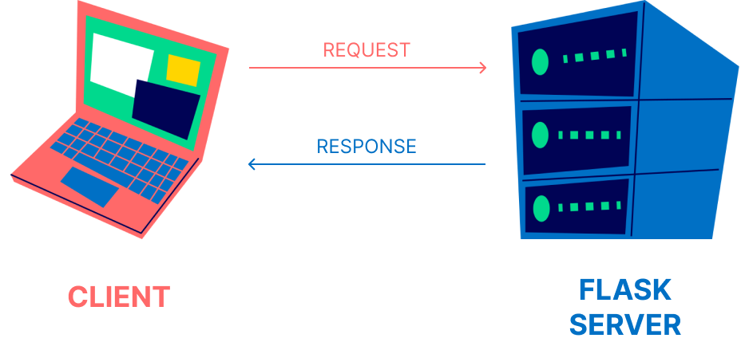

# What is Flask?

Flask is a popular web application framework for Python.
It is lightweight, flexible, and easy to learn, making it a popular choice for developing web applications and APIs.

Flask follows the "micro" philosophy, providing the core functionality needed to build web applications without imposing strict patterns or dependencies.

## Key Features of Flask:

- **Routing:** Flask provides a routing mechanism to map URLs to specific functions or views, allowing you to define the behavior of your application based on different routes.
- **Templating:** Flask includes a templating engine (Jinja2) that allows you to generate dynamic HTML pages by embedding variables, loops, conditionals, and template inheritance.
- **Web Server Gateway Interface (WSGI):** Flask is WSGI compliant, enabling it to run on various web servers, including development servers, production servers, and cloud platforms.
- **Request/Response Handling:** Flask simplifies handling HTTP requests and responses by providing convenient abstractions for accessing request data (e.g., headers, form data, JSON payloads) and generating responses (e.g., setting headers, returning JSON or HTML).

## How Flask Works:

- Flask follows a *request-response cycle*, where it receives an HTTP request, processes it, and returns an HTTP response.
- Requests are routed to specific views/functions based on defined routes in the application.
- Views are Python functions that handle requests and return responses.
- Flask provides request and response objects that allow you to access and manipulate request data (e.g., request parameters, form data) and construct appropriate responses (e.g., HTML, JSON, redirects).

## Flask Extensions and Ecosystem:

- Flask has a rich ecosystem of extensions that provide additional functionality, such as database integration, authentication, form handling, and more.
- Popular Flask extensions include Flask-SQLAlchemy, Flask-WTF, Flask-Login, Flask-RESTful, and Flask-Mail.

Extensions allow developers to easily integrate common features into their Flask applications, speeding up development and reducing boilerplate code.

## Why Use Flask?

- **Lightweight and Minimalistic:** Flask has a small core and minimal dependencies, making it easy to understand, learn, and work with.
- **Flexibility:** Flask allows developers to choose and configure components based on their specific needs, providing the flexibility to build applications tailored to their requirements.
- **Easy to Get Started:** Flask's simplicity and intuitive design make it an excellent choice for beginners and those new to web development.
- **Pythonic:** Flask follows Python's idiomatic design principles, making it feel familiar and comfortable for Python developers.
- **Extensibility:** The vast ecosystem of Flask extensions allows developers to more easily add functionality to their applications, saving development time and effort.
