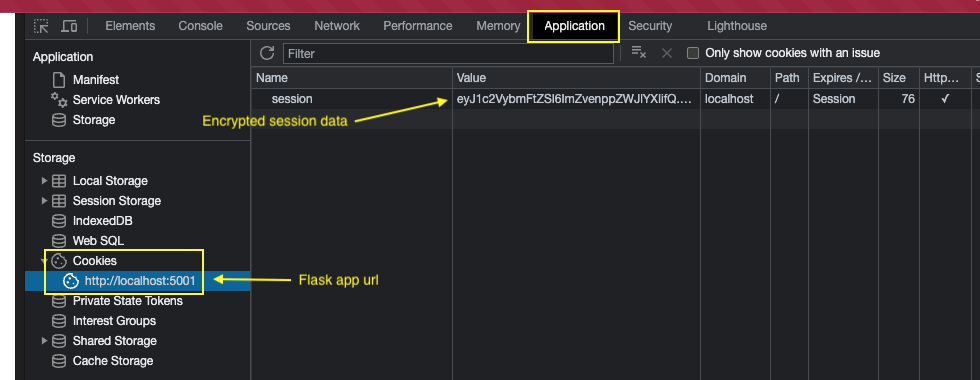
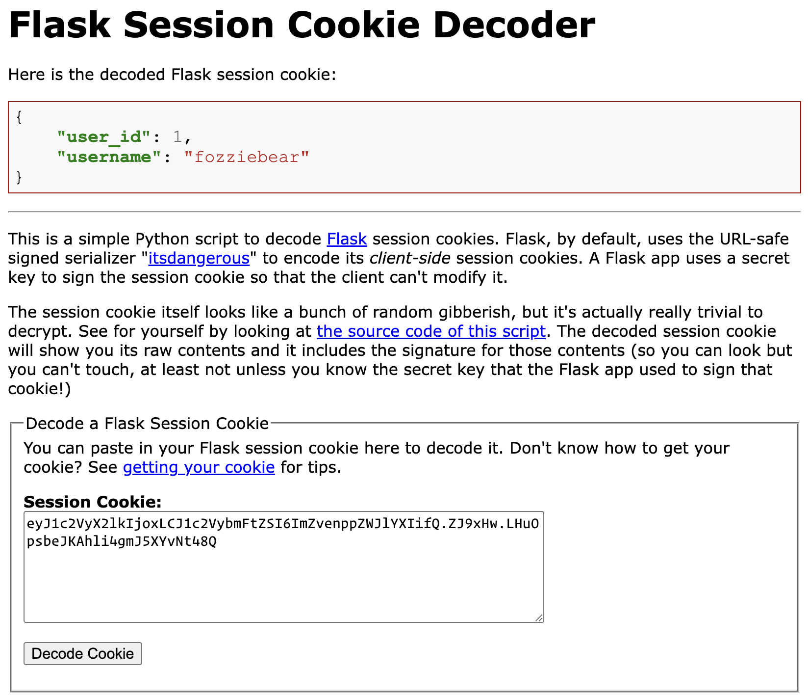

# Flask Sessions
The HTTP protocol is *stateless*, meaning that each request made to the server is independent and does not carry any information or context about previous requests. This can be problematic when we need to maintain user-specific data or remember certain information throughout a user's session on our web application.

It is a bit like hosting a party, but immediately forgetting everyone you meet. Every time you meet someone you've met before, you'd have to start all over.

```py
@app.post("/orders/create")
def create_pizza_order():
  # request.form exists here
  pizza_choice = request.form["pizza"]
  return redirect("/success")

@app.get("/success")
def success():
  # but not here
  return render_template("success.html")
```

To address this limitation, Flask provides a feature called sessions. Sessions allow us to store data on the server and associate it with a specific client. This data can be accessed and modified during the client's interaction with our web application. Sessions provide a way to maintain state across multiple HTTP requests, effectively making our Flask applications more interactive and personalized.

## Why Use Sessions?
There are several scenarios where using sessions becomes beneficial:

1. **User Authentication**: Sessions are commonly used for managing user authentication. When a user logs in, their authentication information can be stored in a session, allowing the server to identify the user for subsequent requests without requiring them to authenticate again for each request.
   
2. **Data Persistence**: Sessions provide a convenient way to store and retrieve user-specific data throughout a session. This can include user preferences, shopping cart items, form data, and other relevant information that needs to persist across multiple requests.

3. **Personalization**: With sessions, we can create personalized experiences for users by storing their preferences, settings, or browsing history. This allows us to customize the content or behavior of our web application based on individual users' preferences.

## Working with Sessions in Flask
Flask provides a simple and intuitive way to work with sessions. Here are the key steps involved:

1. **Enabling Sessions**: To use sessions in Flask, we need to enable them by setting a secret key in our application. The secret key is used to encrypt and sign the session data, ensuring its integrity and security. We can set the secret key by assigning a value to the `app.secret_key` attribute.

    ```py
    from flask import Flask

    app = Flask(__name__)
    app.secret_key = "your_secret_key"
    ```
    The secret key should be as random as possible. Python provides a module that can help us, the `secrets` module.

    ```py
    import secrets
    from flask import Flask

    app = Flask(__name__)
    app.secret_key = secrets.token_hex()
    ```
2. **Storing Data in Sessions**: To store data in a session, we can use the `session` object provided by Flask. It behaves like a regular Python dictionary, allowing us to store key-value pairs.

    ```py
    import secrets
    from flask import Flask, session

    app = Flask(__name__)
    app.secret_key = secrets.token_hex()

    session["username"] = "fozziebear"
    session["user_id"] = 1
    ```
    When a value is stored in the `session` object, it becomes available within the scope of that client's session.

    ```py
    @app.get("/dashboard")
    def dashboard():
      user = {
        "username": session.get("username"),
        "user_id": session.get("user_id")
      }
      return render_template("dashboard.html", user=user)
    ```
    Note that using `session.get()` allows us to retrieve the value of a key without raising an error if the key doesn't exist in the session.

    Also note that session data is available in our Jinja templates without having to explicitly send the data as arguments in `render_template`.

    ```jinja
    <h1>Welcome, {{ session.username }}!</h1>
    ```
    
    Flask uses http-only cookies to store this data in the browser. If you're curious, you can open the Applications tab in your browser's developer tools to see the cookie itself.

    

    We can decode this data at https://www.kirsle.net/wizards/flask-session.cgi. Copy the value of the session cookie and paste it in the text box.

    

    As we can see, session data can easily be decoded from the cookie. Take precautions not to store sensitive information in session, like credit card data or passwords.

    The security of session lies in its signature. It is signed using the `secret_key` that is known only to the server. It can be decoded, but it cannot be *tampered with.*

3. **Removing Data from Sessions**: To remove data from a session, we can use the `session.pop()` method, which removes (and retrieves) the value associated with a given key.

    ```py
    session.pop("username")
    ```
4. **Clearing Sessions**: If we want to clear all data stored in the session, we can use the `session.clear()` method.

    ```py
    session.clear()
    ```

Flask sessions provide a powerful mechanism for managing state and maintaining user-specific data in our web applications. By enabling sessions, we can store and retrieve information across multiple HTTP requests, making our applications more interactive, personalized, and secure.

Using sessions, we can implement user authentication, store user preferences, manage shopping carts, and much more. With Flask's intuitive session handling, working with sessions becomes a seamless experience, allowing us to create dynamic and engaging web applications.
