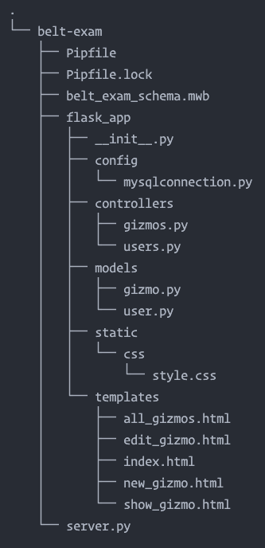

# Python Belt Exam Guidelines
I highly recommend that you prepare your exam project in advance. You should at least have a working login and registration component already tested and working. Have at least one user registered in your database.

An orange or red belt will require implementation of a one-to-many relationship between users and some other table. This other table cannot be pre-coded, but it can be generated from boilerplate templates that you prep beforehand. Use the replace all feature in VS Code and remember to preserve case.

Once you create the second table, seed it with at least one or two rows.

A black belt will require implementation of a many-to-many relationship. For practice, you can add a "likes" or "favorites" feature to the [Coding Dojo Wall assignment](https://login.codingdojo.com/m/506/12465/87451) and/or the [Recipes assignment](https://login.codingdojo.com/m/506/12466/87454). The [Ohana Rideshares assignment](https://login.codingdojo.com/m/506/12466/96503) already includes a many-to-many relationship.

## Project Directory Structure
Screen shot of typical directory structure:



## Preparation Checklist
- [ ] Working Login/Registration
- [ ] Boilerplate model class for the child table (`gizmo.py`)
- [ ] Boilerplate controller for the child table (`gizmos.py`)
- [ ] Boilerplate HTML templates

## Starting the Project
1. Begin by adjusting your prepared ERD. If you're going for an orange or red belt, this requires one more table in addition to your `users` table. A black belt requires a many-to-many relationship, so you'll need a joining table as well if you're going for black.
2. Forward engineer/import your ERD into your MySQL Server. Seed the new table(s) with a couple of rows, just so you have some starting data to pull from your Flask app.
3. Code the model for the child table. Use your boilerplate and execute a find and replace. Remember to check the "preserve case" button.
   > Matchy-matchy: the instance attributes in your `__init__` constructor matches the column names in your table, e.g. `self.title = data["title"]`.
4. Code the first template. This is usually a "read-all" feature or a "dashboard".
   > Matchy-matchy: the property names in your Jinja must match the instance attributes in your `__init__` constructor, e.g. `{{ gizmo.title }}`.
5. Implement the "create" functionality. Refer to code flow below.
6. Implement the "read one" functionality. Refer to code flow below.
7. Implement the "update" functionality. Refer to code flow below.
8. Implement the "delete' functionality. Code flow not added.

### What Syntax Do I Use?
- `<int: gizmo_id>` - controller routes
- `{{ gizmo.id }}`, `{{ gizmo_id }}` - Jinja templates
- `f"/gizmos/{gizmo.id}"`, `f"/gizmos/{gizmo_id}"` - redirects

### Read All Code Flow
1. GET route that returns `render_template`, e.g. `all_gizmos.html`.
2. The controller view function calls the `find_all` class method. Usually, we don't need to pass any arguments, e.g. `Gizmo.find_all()`
3. The `find_all` class method:
   1. Query the database with a `SELECT` statement. Usually, this query does not have any placeholders.
   2. Loop through the list of dictionaries returned by `query_db`. Instantiate objects from each dictionary and append them into a list.
   3. Return the list.
4. Back in the controller view function, store the list returned from the class method in a variable, e.g. `gizmos = Gizmo.find_all()`.
5. Pass the variable to the template as an additional argument to `render_template`.
   ```py
   return render_template("all_gizmos.html", gizmos=gizmos)
   ```
6. In the template, loop over the list with a Jinja for-loop.

### Create Code Flow
**Prep:**
1. GET route that renders form
2. HTML template with form:
   1. Form element must have an action and a method
   2. Action defines the form processing route
   3. Method must be "POST"
   4. **Every placeholder in your SQL query must have corresponding `name` attributes in your form**
   5. **This includes a hidden input for the logged-in user's id (`user_id`).**
   6. A submit button INSIDE the form

**Submit Flow:**
1. User submits form as POST request to the processing route
2. Processing POST handler in controller receives request
3. Validator static method is called
4. Validator checks each input for validity in series of `if elif` blocks and returns a boolean value of `True` or `False`
5. Back in controller, if validator function returns `False`, redirect the user back to form and display error messages
6. Repeat steps 1-5 until validator returns `True`
7. If validator returns `True`, create new row in database by calling the `create` class method (the platform calls it `save`). Pass the form as an argument, e.g. `Gizmo.create(request.form)`.
8. The `create` class method must have a SQL `INSERT` query with placeholders that match the `name` attributes for the inputs in your form
9. `connectToMySql` function is called
10. `query_db` is chained and called, and we pass the query and `form_data` to it
11. `query_db` returns the id of the row it created for `INSERT` queries (or `False` if your query fails)
12. Back in controller, we can use the id that was returned from `query_db` to redirect the user to the details route
13. Or we can just redirect the user to the route that displays all (this is what will usually be the case)

### Read One Code Flow
1. GET route that returns `render_template`, e.g. `show_gizmo.html`.
2. The controller view function calls the `find_by_id` class method. Pass the id from the URL as an argument, e.g. `Gizmo.find_by_id(gizmo_id)`
3. The `find_by_id()` class method:
   1. Query the database with a `SELECT` statement. This statement will include a `WHERE` clause with a placeholder.
   2. Create a data dictionary. Its keyname must match the placeholder. The value is the id passed in from the controller.
   3. The `query_db` method returns a list with one dictionary. Instantiate an object from this dictionary.
   4. Return the object.
4. Back in the controller view function, store the object returned from the class method in a variable, e.g. `gizmo = Gizmo.find_by_id(gizmo_id)`.
5. Pass the variable to the template as an additional argument to `render_template`.
   ```py
   return render_template("show_gizmo.html", gizmo=gizmo)
   ```
6. In the template, display any required properties with Jinja.

### Update Code Flow
**Prep:**
1. GET route that renders form
2. HTML template with form:
   1. Form element must have an action and a method
   2. Action defines the form processing route
   3. Method must be "POST"
   4. **Every placeholder in your SQL query must have corresponding `name` attributes in your form's inputs**
   5. **This may include a hidden input for the id of the row you're updating (`gizmo_id`).**
   6. A submit button INSIDE the form

**Submit Flow:**
1. User submits form as POST request to the processing route
2. Processing POST handler in controller receives request
3. Validator static method is called
4. Validator checks each input for validity in series of `if elif` blocks and returns a boolean value of `True` or `False`
5. Back in controller, if validator function returns `False`, redirect the user back to form and display error messages
6. Repeat steps 1-5 until validator returns `True`
7. If validator returns `True`, update the existing row in database by calling the `update` class method.
8. The `update` class method must have a SQL `UPDATE` query with placeholders that match the `name` attributes for the inputs in your form
9. `connectToMySql` function is called
10. `query_db` is chained and called, and we pass the query and `form_data` to it
11. `query_db` returns `None` for `UPDATE` queries (or `False` if your query fails)
12. Back in controller, we use the `gizmo_id` from the form to redirect the user to the details route
